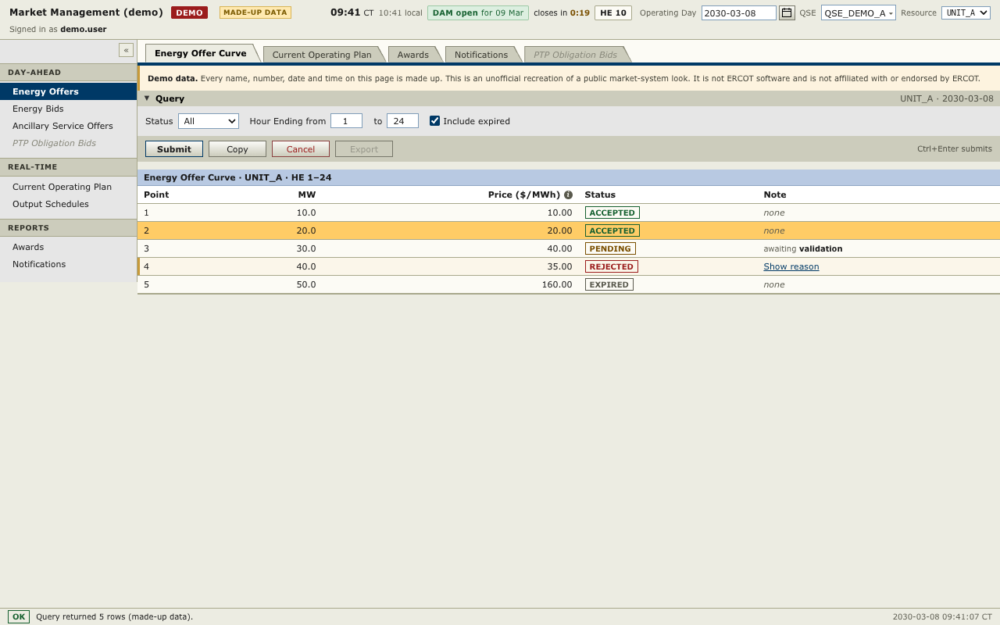

# unofficial-ercot-mms-skin

**Unofficial.** Not affiliated with or endorsed by ERCOT. This is an independent CSS recreation of the look
of ERCOT's Market Management System (MMS) screens. It is not ERCOT software.

Teams that build their own tools for ERCOT market operations (offer and bid entry, current operating plans,
awards, notifications) can use it so those screens read like the MMS their operators already know: slanted tabs
over a navy rule, header bands, 23px grid rows, a pale-blue results title and an amber selected row. It is plain
CSS with design tokens, no framework and no runtime dependencies.



## Quickstart

```sh
git clone https://github.com/wattness/unofficial-ercot-mms-skin.git
cd unofficial-ercot-mms-skin
npm install          # also builds dist/
open demo/index.html # macOS; use xdg-open on Linux or start on Windows
```

Needs Node 22 or later. The demo uses made-up names and numbers throughout.

## Use

```html
<html lang="en" data-skin="mms">
  <head>
    <link rel="stylesheet" href="dist/mms-skin.css" />
  </head>
</html>
```

Every rule is scoped under `[data-skin="mms"]`, so the stylesheet can sit beside another theme and is switched
on by the attribute. With a bundler, install from GitHub and import the package:

```sh
npm install github:wattness/unofficial-ercot-mms-skin
```

```js
import "unofficial-ercot-mms-skin";
import tokens from "unofficial-ercot-mms-skin/tokens.json" with { type: "json" };
```

`tokens.json` holds the resolved token values for charts and canvas code. To take only some components, import
`src/tokens.css`, `src/base.css` and the files you need from `src/components/`.

## Components

| Component       | Classes                                                        | Source                           |
| --------------- | -------------------------------------------------------------- | -------------------------------- |
| Page frame      | `layout`, `layout-main`, `content`, `prose`, `spacer`          | `src/components/layout.css`      |
| Masthead        | `masthead`, `masthead-title`, `env-badge`, `masthead-controls` | `src/components/masthead.css`    |
| Market clock    | `clock`, `phase` (8 modifiers), `countdown`                    | `src/components/clock.css`       |
| Side navigation | `sidenav`, `sidenav-heading`, `sidenav-item`, `sidenav-toggle` | `src/components/sidenav.css`     |
| Tab strip       | `tabstrip`, `tab`, `tabstrip-rule`                             | `src/components/tabstrip.css`    |
| Section         | `section`, `section-header`, `section-caret`, `section-note`   | `src/components/section.css`     |
| Query panel     | `query`, `query-field`, `actions`, `actions-hint`              | `src/components/query.css`       |
| Controls        | inputs, `select`, `checkbox`, `btn`, `link-button`             | `src/components/controls.css`    |
| Date picker     | `datepicker`, `calendar`, `calendar-day`                       | `src/components/datepicker.css`  |
| Combobox        | `combobox`, `combobox-button`, `combobox-popup`                | `src/components/combobox.css`    |
| Results grid    | `grid`, `grid-title`, `grid-scroll`, `selectable`, `flagged`   | `src/components/grid.css`        |
| Hourly grid     | `hourly`, `row-label`, `neg`, `pos`, `zero`, `edited`          | `src/components/hourly-grid.css` |
| Notes and pills | `note`, `pill`, `badge`, `aside`                               | `src/components/notes.css`       |
| Info popover    | `info`, `info-mark`, `popover`                                 | `src/components/popover.css`     |
| Status bar      | `statusbar`, `statusbar-code`, `statusbar-stamp`               | `src/components/statusbar.css`   |

Markup for each, with every class and state, is in
[skills/building-mms-screens/references/components.md](skills/building-mms-screens/references/components.md).
States use ARIA attributes where one exists (`aria-selected`, `aria-current`, `aria-expanded`, `aria-disabled`,
`aria-pressed`), so the look follows the accessible markup.

The stylesheet ships no JavaScript. `demo/demo.js` shows one way to wire tabs, sections, the calendar and the
combobox.

## Where the look came from

Ten values were measured from ERCOT's screenshot of the MMS Energy Bid Curve screen in a public presentation,
[ERCOT-TWG-2026-08-20-NPRR-1188-System-Impacts.pptx](https://www.ercot.com/files/docs/2026/08/20/ERCOT-TWG-2026-08-20-NPRR-1188-System-Impacts.pptx)
(slide 5, "Market Manager (MMS UI) Changes"; `ppt/media/image11.png`, 1184×445). They are marked `sampled` in
`src/tokens.css`:

| Token               | Value     | Pixels in the screenshot | Checked at (x, y)                                 |
| ------------------- | --------- | -----------------------: | ------------------------------------------------- |
| `--mms-bg`          | `#ecece2` |                  168,508 | selected tab (680, 40); query row (1000, 118)     |
| `--mms-surface`     | `#fcfbf5` |                  155,513 | tab strip (1050, 15); grid row (600, 290)         |
| `--mms-band`        | `#ccccbc` |                   88,546 | unselected tab (60, 35); section header (600, 80) |
| `--mms-head-bg`     | `#fff`    |                   28,796 | grid column headers (600, 243)                    |
| `--mms-title-band`  | `#b8c9e2` |                   27,125 | results grid title (600, 216)                     |
| `--mms-selected-bg` | `#ffcc66` |                   24,167 | selected row (600, 266)                           |
| `--mms-rule`        | `#a8a88c` |                   15,040 | rule between rows (600, 254)                      |
| `--mms-accent`      | `#003966` |                    4,534 | rule under the tab strip (600, 65)                |
| `--mms-row-height`  | `23px`    |                        — | pitch of the row rules (seen 6 times)             |
| `--mms-strip-rule`  | `4px`     |                        — | height of the navy rule                           |

Reproduce the table:

```sh
npm run verify-provenance
```

The script downloads the deck, checks its SHA-256, decodes the image, counts pixels and checks each listed
location. ercot.com refuses some regions and clients; if the download fails, save the file from a browser and
run `node scripts/verify-provenance.mjs --deck path/to/file.pptx`.

Everything else (type, the query panel and side navigation grey, field borders, hover and disabled shades, the
market clock, notes and pills) was chosen to sit with those values and is not claimed to match ERCOT's screens.
In the screenshot the query row is `#ecece2`; the skin draws its query panel in `#e6e6e6`.

## Accessibility

`scripts/contrast.mjs` lists the text and background token pairs the components produce: each component's own
pairs, every text colour a grid cell can hold on plain, hovered, selected and flagged rows, and hourly-grid
values on plain, selected, edited and focused cells. It prints the ratio of each:

```sh
node scripts/contrast.mjs
```

All 79 text pairs reach the WCAG AA ratio of 4.5:1. The 7 disabled-state pairs are lower, which WCAG 1.4.3 allows
for inactive components. One pair is lower by design: a zero in a read-only hourly cell (`--mms-text-zero` on
`--mms-surface`, 2.46:1) is faint so the non-zero hours stand out; in inputs, edited cells and selected rows a
zero uses `--mms-text-muted`. `npm test` fails if a listed text pair drops below 4.5:1, a new exception appears,
or these counts go stale.

## For AI agents

- [skills/building-mms-screens](skills/building-mms-screens/SKILL.md) is an
  [Agent Skill](https://agentskills.io/specification) for building screens with the skin and checking them:
  `node scripts/check-screen.mjs page.html`, run from the skill's folder.
- [AGENTS.md](AGENTS.md) is for coding agents working on this repository.

## Development

```sh
npm run build   # dist/mms-skin.css, dist/tokens.json, and the skill's copies of both
npm test        # scoping, tokens, contrast, the skill and its checker
npm run lint    # prettier, stylelint and eslint
```

See [CONTRIBUTING.md](CONTRIBUTING.md).

## Licence

MIT; see [LICENSE](LICENSE). The Libre Franklin font keeps its own licence (SIL OFL), and the not-affiliated notice is in [NOTICE](NOTICE).
