# Provenance

**Unofficial.** Not affiliated with or endorsed by ERCOT. Every image captioned "Source: ERCOT" is ERCOT's;
[sources.md](sources.md) lists each one with its document, SHA-256 and how it was cut.

The values marked `sampled` in `src/tokens.css` come from one image, ERCOT's 2026 screenshot of the Energy Bid Curve
screen, and the skin follows that screen. This page adds the older public record. In 2007 ERCOT posted drafts of these
screens for review at UI Subgroup meetings; on 8 October 2026 the files were still on ercot.com. Each excerpt below
sits beside the matching part of the skin.

No value in `src/tokens.css` is taken from the 2007 documents. Between them, the Market Manager screenshots in ERCOT's
2007 MMS UI Prototypes use seven of the eight sampled colours exactly, and each has a 4px navy rule like today's. None
has an amber selected row; a close amber (`#f7ca68`) fills the title bands of the trade grids. Their grid rows are
25px or more apart, against 23px today.

## Today's screen

Source: ERCOT, NPRR 1188 – System Impacts Overview, 20 August 2026, slide 5,
[ERCOT-TWG-2026-08-20-NPRR-1188-System-Impacts.pptx](https://www.ercot.com/files/docs/2026/08/20/ERCOT-TWG-2026-08-20-NPRR-1188-System-Impacts.pptx).
Unmodified; ERCOT added the red ovals and blurred the resource names. Redistributed on the terms of section 5 of
ERCOT's Website User Agreement, kept in [ercot/ERCOT-TERMS-OF-USE.txt](ercot/ERCOT-TERMS-OF-USE.txt).

This skin: the same screen on made-up data, [demo/energy-bid-curve.html](../demo/energy-bid-curve.html). The ten
sampled values were measured from ERCOT's image above.

## Tab strip

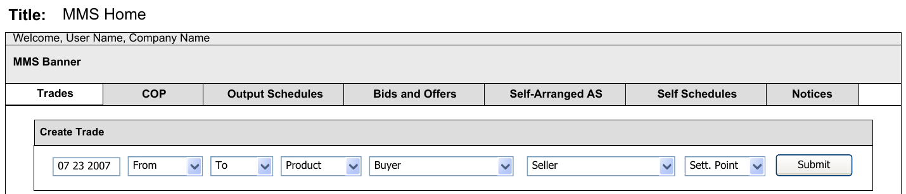

Source: ERCOT, MMS Wireframes, Conceptual Designs, Version 0.02, 15 August 2007, page 2,
[mms_wireframes_v0.03.pdf](https://www.ercot.com/files/docs/2007/08/15/mms_wireframes_v0.03.pdf). Crop of a render
of that page.

This skin: tab strip (`src/components/tabstrip.css`). The August 2007 wireframe marks the selected tab by leaving it
white; the skin draws today's slanted tabs over the navy rule.

## Query panel

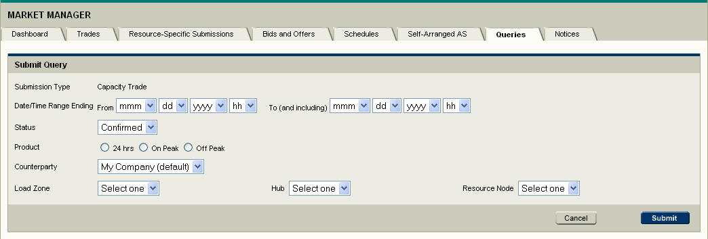

Source: ERCOT, MMS UI Prototypes, 31 October 2007, page 15,
[mer_mms_hf_prototypes_v0_03.doc](https://www.ercot.com/files/docs/2007/10/31/mer_mms_hf_prototypes_v0_03.doc).
© 2007 Electric Reliability Council of Texas, Inc. Crop of the screenshot embedded on that page.

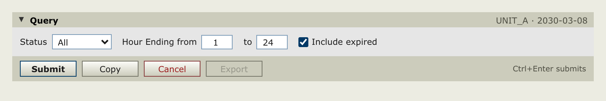

This skin: query panel (`src/components/query.css`), made-up values. Both stack a title band, a block of labelled
criteria and a band of buttons.

## Results grid

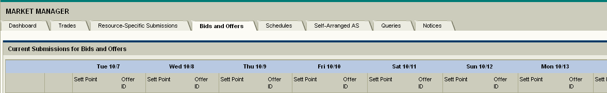

Source: ERCOT, User Interface Status, 6 November 2007, slide 11,
[19_presentation_user_interface_status.ppt](https://www.ercot.com/files/docs/2007/11/02/19_presentation_user_interface_status.ppt).
Crop of the screenshot embedded on that slide, above its first row.

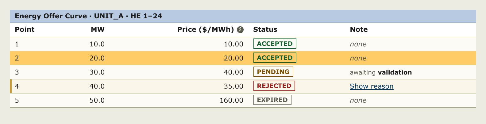

This skin: results grid (`src/components/grid.css`), made-up rows. In 2007 the pale blue (`#b8c9e2`) filled the band
of operating days; on today's screen it fills the results title, as in the skin.

## Form controls

Source: ERCOT, MMS UI Prototypes, 31 October 2007, page 12,
[mer_mms_hf_prototypes_v0_03.doc](https://www.ercot.com/files/docs/2007/10/31/mer_mms_hf_prototypes_v0_03.doc).
© 2007 Electric Reliability Council of Texas, Inc. Crop of the screenshot embedded on that page.

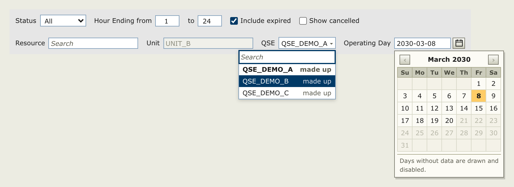

This skin: controls, combobox and date picker (`src/components/controls.css`, `combobox.css`, `datepicker.css`),
made-up values. The 2007 form already pairs selects and checkboxes with a calendar button.

## Side navigation

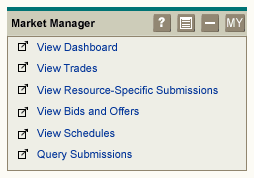

Source: ERCOT, User Interface Status, 6 November 2007, slide 7,
[19_presentation_user_interface_status.ppt](https://www.ercot.com/files/docs/2007/11/02/19_presentation_user_interface_status.ppt).
Crop of the screenshot embedded on that slide, a prototype MIS landing page.

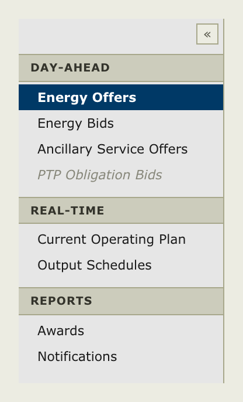

This skin: side navigation (`src/components/sidenav.css`). In the 2007 prototype the Market Manager screens are links
in a portlet on the MIS landing page; the skin groups screens under headings in a side panel.

## Operating day and clock

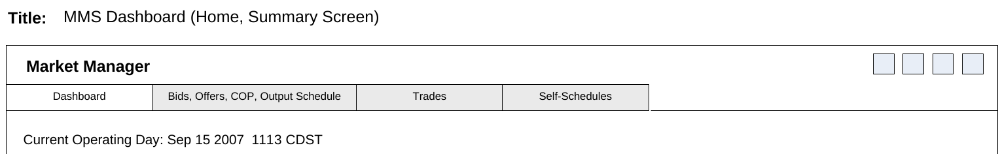

Source: ERCOT, MMS Wireframes, Conceptual Designs, Version 0.03, 13 September 2007, page 7,
[mms_wireframes_v0.04.doc](https://www.ercot.com/files/docs/2007/09/13/mms_wireframes_v0.04.doc). Crop of a render of
the drawing on that page.

This skin: masthead and market clock (`src/components/masthead.css`, `clock.css`), made-up values. The September 2007
dashboard shows the operating day and the time under the tabs; the skin's masthead carries both.

## A whole screen

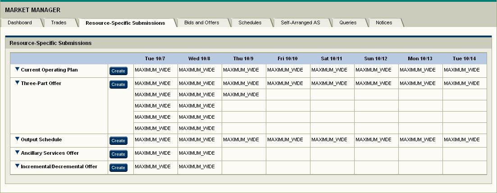

Source: ERCOT, MMS UI Prototypes, 31 October 2007, page 6,
[mer_mms_hf_prototypes_v0_03.doc](https://www.ercot.com/files/docs/2007/10/31/mer_mms_hf_prototypes_v0_03.doc).
© 2007 Electric Reliability Council of Texas, Inc. Crop of the screenshot embedded on that page.

This skin: [demo/index.html](../demo/index.html) on made-up data. Both have a navy rule under the tabs and a pale-blue
band at the top of the grid.

## 2007 review meetings

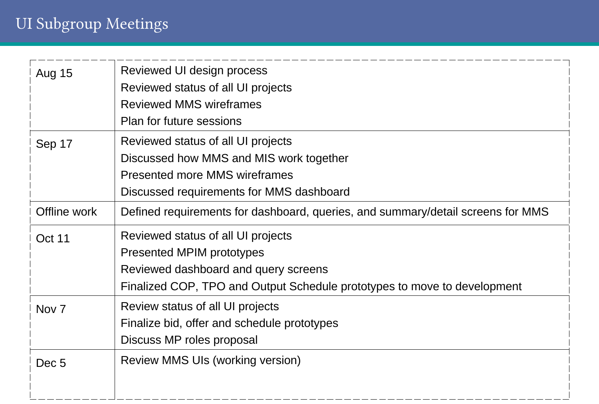

Source: ERCOT, User Interface Status, 6 November 2007, slide 4,
[19_presentation_user_interface_status.ppt](https://www.ercot.com/files/docs/2007/11/02/19_presentation_user_interface_status.ppt).
Crop of a render of that slide.

The next slide, "UI Subgroup Participation", reads "114 individual subscribers to exploder list" and "23 companies
participating in meetings"; its list of companies is not reproduced here. The prototypes of 31 October 2007 open:

> This document contains the third iteration of paper prototypes for MMS screens. […] The deadline for comments is
> Nov. 7 at the UI Subgroup meeting. […]
>
> We plan to improve on the design during 2008 with feedback from MPs.

ERCOT's pages for these meetings list the documents (checked on 8 October 2026), and below the list they say: "All
information is posted as Public in accordance with the ERCOT Websites Content Management Corporate Standard."
